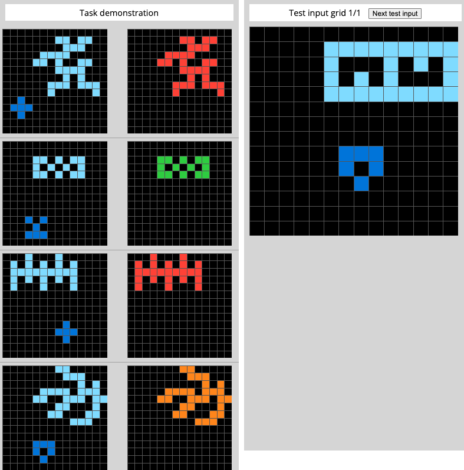
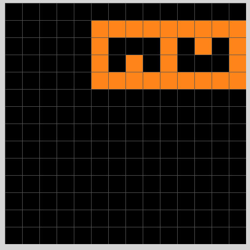

# Solution for evaluation/009d5c81.json written in shorthand form

## Step 1: Observations
### 1.1: Objects
#### Input example 1:
1. i1 (the light-blue object on the upper side in the input)
1. i2 (the dark-blue object on the lower side in the input)
1. o1 (the red object in the output)
1. ...

#### Input example 2:
1. i1 (the light-blue object on the upper side in the input)
1. i2 (the dark-blue object on the lower side in the input)
1. o1 (the red object in the output)
1. ...

#### Input example 3:
1. i1 (the light-blue object on the upper side in the input)
1. i2 (the dark-blue object on the lower side in the input)
1. o1 (the red object in the output)
1. ...

...

### 1.2: Params and Self-relations
#### Input example 1:
1. i1 is above i2
1. o1.pattern = i1.pattern
1. i1.type = continuous-color
1. o1.color = red
1. i1 is bigger than i2
1. i1's length is 30
1. i2's length is 5
1. i1's length - i2's length is 25
1. ... so on
    
#### Input example 2:
1. i1 is above i2
1. i1.pattern = o1.pattern
1. i1.type = continuous-color
1. o1.color = green
1. i1 is bigger than i2
1. i1's length is 14
1. i1's length is 6
1. i1's length - i2's length is 8
1. ... so on

## Step 2: Changes from input to output
### Input example 1:
1. i1 removed
1. i2 removed
1. o1 added
    
### Input example 2:
1. i1 removed
1. i2 removed
1. o1 added
    
...

##  Step 3: Dict of all possible changes to observations (statements)
### Input example 1:
1. (new obj1).pattern = (item above).pattern
1. (new obj1).pattern = (item above).pattern if item.type == continuous-color
1. (new obj1).placement = (item above).placement if item.type == continuous-color
1. (new obj1).color = red if (item below).pattern == i2.pattern
1. (new obj1).color = red if (item above).pattern
1. (new obj1).color = red if (item below).pattern
1. .. so on

### Input example 2:
1. (new obj1).pattern = (item above).pattern
1. (new obj1).pattern = (item above).pattern if item.type == continuous-color
1. (new obj1).placement = (item above).placement if item.type == continuous-color
1. (new obj1).color = red if (item below).pattern == i2.pattern
1. (new obj1).color = red if (item above).pattern
1. (new obj1).color = red if (item below).pattern
1. .. so on

##  Step 4: Minimal number of statements
### Possible soln 1:
1. (new obj1).pattern = (item above).pattern
1. (new obj1).placement = (item above).placement
1. (new obj1).color = red if (item below).pattern == i2.pattern from example 1
1. (new obj1).color = green if (item below).pattern == i2.pattern from example 2
1. (new obj1).color = orange if (item below).pattern == i2.pattern from example 3

### Possible soln 2:
1. (new obj1).pattern = (item with most length).pattern
1. (new obj1).placement = (item above).placement
1. (new obj1).color = red if (item below).pattern == i2.pattern from example 1
1. (new obj1).color = green if (item below).pattern == i2.pattern from example 2
1. (new obj1).color = orange if (item below).pattern == i2.pattern from example 3
    
### Possible soln 3:
1. (new obj1).pattern = (item with most length).pattern
1. (new obj1).placement = (item with most length).placement
1. (new obj1).color = red if (item below).pattern == i2.pattern from example 1
1. (new obj1).color = green if (item below).pattern == i2.pattern from example 2
1. (new obj1).color = orange if (item below).pattern == i2.pattern from example 3

### Possible soln 4:
1. (new obj1).pattern = (item above).pattern
1. (new obj1).placement = (item with most length).placement
1. (new obj1).color = red if (item below).pattern == i2.pattern from example 1
1. (new obj1).color = green if (item below).pattern == i2.pattern from example 2
1. (new obj1).color = orange if (item below).pattern == i2.pattern from example 3

..so on

## Step 5: Apply to test case
### Solution 1:
1. 1 object in the output
1. (new obj1).pattern = (item above).pattern
1. (new obj1).placement = (item above).placement
1. (new obj1).color = orange because (item below).pattern == i2.pattern from example 4
    
### Solution 2:
1. 1 object in the output
1. (new obj1).pattern = (item above).pattern
1. (new obj1).placement = (item above).placement
1. (new obj1).color = orange because (item below).pattern == i2.pattern from example 4
    

.. so on 

