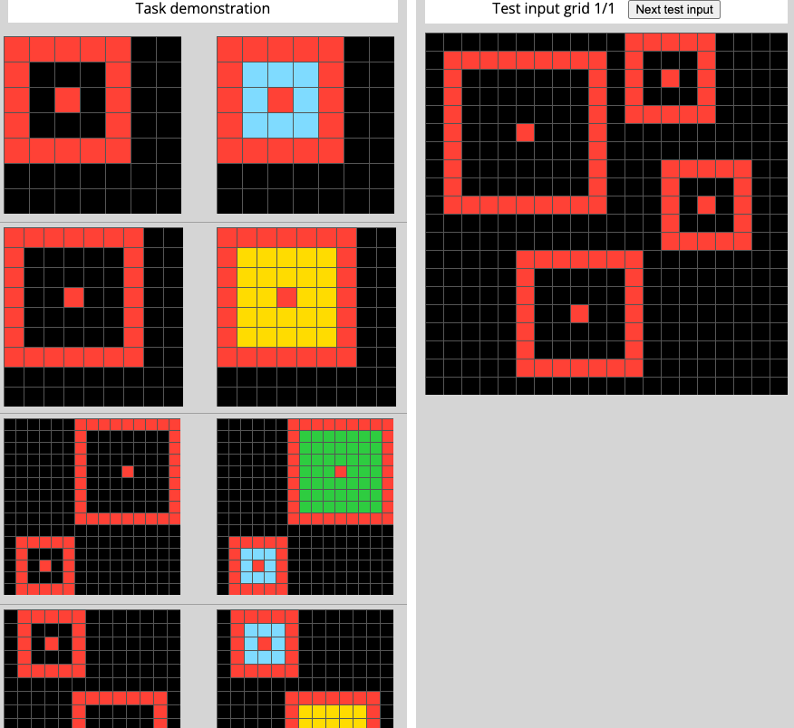
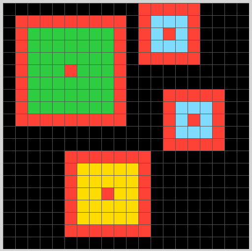

# Solution for evaluation/00dbd492.json written in shorthand form

## Step 1: Observations
### 1.1: Objects
#### Input example 1:
1. i1 (the red object on outside in the input)
1. i2 (the red object on inside in the input)
1. o1 (the light-blue object in the output)
1. ...

#### Input example 2:
1. i1 (the red object on outside in the input)
1. i2 (the red object on inside in the input)
1. o1 (the yellow object in the output)
1. ...

#### Input example 3:
1. i1 (the red object on outside on the upper side in the input)
1. i2 (the red object on inside on the upper side in the input)
1. i3 (the red object on outside on the lower side in the input)
1. i4 (the red object on inside on the lower side in the input)
1. o1 (the green object in the output)
1. o2 (the light-blue object in the output)
1. ...

...

### 1.2: Params and Self-relations
#### Input example 1:
1. i2 inside i1
1. i1 placement is i2 placement
1. i1 length is 16
1. i2 length is 1
1. i1's cavity's shape is o1
1. i1's cavity's placement is o1
1. o1's size is 8
1. ...
    
#### Input example 2:
1. i2 inside i1
1. i1 placement is i2 placement
1. i1 length is 16
1. i2 length is 1
1. i1's cavity's shape is o1
1. i1's cavity's placement is o1
1. o1's size is 24
1. ... so on

## Step 2: Changes from input to output
### Input example 1:
1. i1 retained
1. i2 retained
1. o1 added
    
### Input example 2:
1. i1 retained
1. i2 retained
1. o1 added

### Input example 3:
1. i1 retained
1. i2 retained
1. i3 retained
1. i4 retained
1. o1 added
1. o2 added
    
...

##  Step 3: Dict of all possible changes to observations (if-statements)
### Input example 1:
1. (new obj1).pattern = (item outside).cavity.pattern
1. (new obj1).pattern = (item outside).cavity.pattern if item.type == continuous-color
1. (new obj1).placement = (item outside).cavity.placement
1. (new obj1).color = light-blue
1. (new obj1).color = light-blue if (item outside).size == 16
1. (new obj1).color = light-blue if (item inside).size == 1
1. (new obj1).color = light-blue if (item outside).cavity.size == 8
1. .. so on

### Input example 2:
1. (new obj1).pattern = (item outside).cavity.pattern
1. (new obj1).pattern = (item outside).cavity.pattern if item.type == continuous-color
1. (new obj1).placement = (item outside).cavity.placement
1. (new obj1).color = yellow
1. (new obj1).color = yellow if (item outside).size == 24
1. (new obj1).color = yellow if (item inside).size == 1
1. (new obj1).color = yellow if (item outside).cavity.size == 24
1. .. so on

##  Step 4: Minimal number of if-statements
### Possible soln 1:
1. (new obj1).pattern = (item-outside 1).cavity.pattern
1. (new obj1).placement = (item-outside 1).cavity.placement
1. (new obj1).color = light-blue if (new obj1).size == 8
1. (new obj1).color = yellow if (new obj1).size == 24
1. (new obj2).pattern = (item-outside 2).cavity.pattern
1. (new obj2).placement = (item-outside 2).cavity.placement
1. (new obj2).color = light-blue if (new obj2).size == 8
1. (new obj2).color = yellow if (new obj2).size == 24
1. ..

### Possible soln 2:
1. (new obj1).pattern = (item-outside 1).cavity.pattern
1. (new obj1).placement = (item-outside 1).cavity.placement
1. (new obj1).color = light-blue if (item-outside 1).size == 8
1. (new obj1).color = yellow if (item-outside 1).size == 24
1. (new obj2).pattern = (item-outside 2).cavity.pattern
1. (new obj2).placement = (item-outside 2).cavity.placement
1. (new obj2).color = light-blue if (item-outside 2).size == 8
1. (new obj2).color = yellow if (item-outside 2).size == 24
1. ..

..so on

## Step 5: Apply to test case
### Solution 1:
1. 12 objects in the output
1. All input objects retained
1. (new obj1).pattern = (item-outside 1).cavity.pattern
1. (new obj1).placement = (item-outside 1).cavity.placement
1. (new obj1).color = green because (new obj1).size == 48
1. (new obj2).pattern = (item-outside 2).cavity.pattern
1. (new obj2).placement = (item-outside 2).cavity.placement
1. (new obj2).color = light-blue because (new obj2).size == 8
1. (new obj3).pattern = (item-outside 3).cavity.pattern
1. (new obj3).placement = (item-outside 3).cavity.placement
1. (new obj3).color = yellow because (new obj1).size == 24
1. (new obj4).pattern = (item-outside 4).cavity.pattern
1. (new obj4).placement = (item-outside 4).cavity.placement
1. (new obj4).color = light-blue because (new obj4).size == 8
 
    

.. so on 

