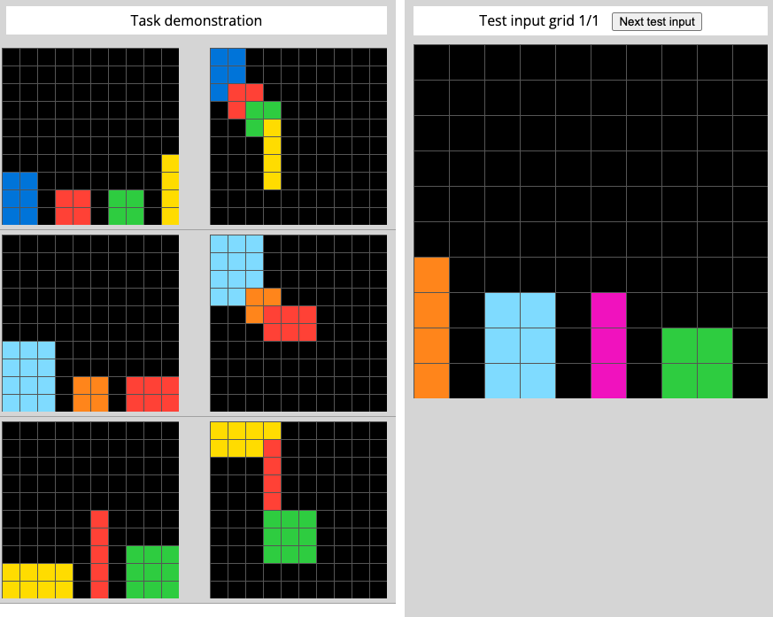
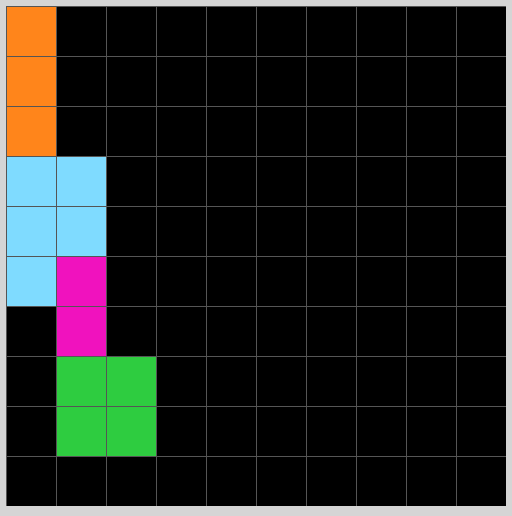

# Solution for evaluation/03560426.json written in shorthand form

## Step 1: Observations
### 1.1: Objects
#### Input example 1:
1. i1 (left most)
1. i2 (second from left)
1. i3 (third from left)
1. i4 (right most)
1. o1 (the blue one, overlapping)
1. o2 (the red one, overlapping)
1. o3 (the green one, overlapping)
1. o4 (the yellow one)
1. ...

#### Input example 2:
1. i1 (left most)
1. i2 (second from left)
1. i3 (third from left)
1. o1 (light-blue, overlapping)
1. o2 (orange, overlapping)
1. o3 (red, overlapping)
1. ...

...

### 1.2: Params and Self-relations
#### Input example 1:
1. i1 to the left of i2 to the left of i3 to the left of i4
1. i1, i2, i3, i4 on the same level
1. color blue is to the left of color red is to the left of color green is to the left of color yellow
1. o1.pattern == i1.pattern
1. o1.color == i1.color
1. o2.pattern == i2.pattern
1. o2.color == i2.color
1. o3.pattern == i3.pattern
1. o3.color == i3.color
1. o4.pattern == i4.pattern
1. o4.color == i4.color
1. i1 length is 6
1. i2 length is 4
1. ...
    
#### Input example 2:
1. i1 to the left of i2 to the left of i3
1. i1, i2, i3 on the same level
1. color light-blue is to the left of color orange is to the left of color red
1. o1.pattern == i1.pattern
1. o1.color == i1.color
1. o2.pattern == i2.pattern
1. o2.color == i2.color
1. o3.pattern == i3.pattern
1. o3.color == i3.color
1. i1 length is 12
1. i2 length is 4
1. ... so on

## Step 2: Changes from input to output
### Input example 1:
1. i1 removed
1. i2 removed
1. i3 removed
1. i4 removed
1. o1 added
1. o2 added
1. o3 added
1. o4 added
    
### Input example 2:
1. i1 removed
1. i2 removed
1. i3 removed
1. o1 added
1. o2 added
1. o3 added
    
...

##  Step 3: Dict of all possible changes to observations (if-statements)
### Input example 1:
1. (new obj1).pattern = i1.pattern
1. (new obj1).pattern = (leftmost).pattern
1. (new obj1).placement = TOPLEFT
1. (new obj1).color = (leftmost).color
1. (new obj2).pattern = (second from left).pattern
1. (new obj2).pattern = (second from left).pattern
1. (new obj2).topleft = (new obj1).bottomright
1. (new obj2).color = (second from left).color
1. .. so on

### Input example 2:
1. (new obj1).pattern = i1.pattern
1. (new obj1).pattern = (leftmost).pattern
1. (new obj1).placement = TOPLEFT
1. (new obj1).color = (leftmost).color
1. (new obj2).pattern = (second from left).pattern
1. (new obj2).pattern = (second from left).pattern
1. (new obj2).topleft = (new obj1).bottomright
1. (new obj2).color = (second from left).color
1. .. so on

##  Step 4: Minimal number of if-statements
### Possible soln 1:
1. (new obj1).pattern = i1.pattern
1. (new obj1).pattern = (leftmost).pattern
1. (new obj1).placement = TOPLEFT
1. (new obj1).color = (leftmost).color
1. (new obj2).pattern = (second from left).pattern
1. (new obj2).pattern = (second from left).pattern
1. (new obj2).topleft = (new obj1).bottomright
1. (new obj2).color = (second from left).color
1. .. so on

## Step 5: Apply to test case
### Solution 1:
1. 4 objects in the output
1. All input objects removed
1. (new obj1).pattern = i1.pattern
1. (new obj1).pattern = (leftmost).pattern
1. (new obj1).placement = TOPLEFT
1. (new obj1).color = (leftmost).color
1. (new obj2).pattern = (second from left).pattern
1. (new obj2).pattern = (second from left).pattern
1. (new obj2).topleft = (new obj1).bottomright
1. (new obj2).color = (second from left).color
1. (new obj3).pattern = (third from left).pattern
1. (new obj3).pattern = (third from left).pattern
1. (new obj3).topleft = (new obj2).bottomright
1. (new obj3).color = (third from left).color
1. (new obj4).pattern = (fourth from left).pattern
1. (new obj4).pattern = (fourth from left).pattern
1. (new obj4).topleft = (new obj3).bottomright
1. (new obj4).color = (fourth from left).color

